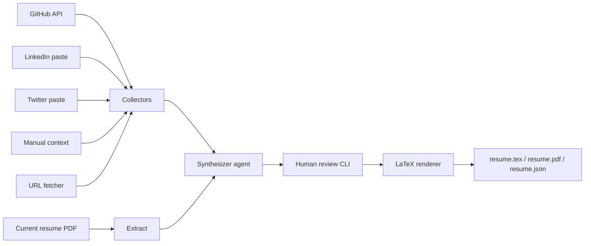

# Resume Agent

Multi-agent resume updater built with **LangGraph** and **Claude**. It pulls fresh data from your GitHub, pasted LinkedIn/Twitter text, manual notes, and arbitrary URLs, merges that with your existing PDF resume, lets you review section-by-section, then renders a new **LaTeX + PDF**.

## Architecture



**Agents (LangGraph nodes):**
| Agent | Role |
|---|---|
| GitHub collector | Repos, stars, languages, README excerpts |
| LinkedIn loader | Reads pasted profile text |
| Twitter loader | Reads pasted bio / pinned tweets |
| Manual context loader | Hackathon wins, recent work, free-form notes |
| URL fetcher | Fetches project pages, Devpost, blogs |
| Synthesizer | Claude merges everything into structured JSON resume |

## Quick start

```bash
# 1. Create virtualenv and install deps
python3 -m venv .venv
source .venv/bin/activate
pip install -r requirements.txt

# 2. Configure secrets
cp .env.example .env
# Edit .env — set ANTHROPIC_API_KEY (required)
# Optional: GITHUB_TOKEN for higher rate limits

# 3. Fill config + input files
python -m src.main init-inputs
# Edit config.yaml — name, email, github_username, links
# Put your current resume at inputs/resume.pdf
# Paste LinkedIn/Twitter text into inputs/*.txt
# Add hackathon wins / context to inputs/manual_context.md
# Add URLs to inputs/urls.txt

# 4. Run
python -m src.main update
```

## Commands

```bash
# Full pipeline with interactive review (default)
python -m src.main update

# Custom PDF path
python -m src.main update --pdf ~/Downloads/my_resume.pdf

# Skip human review (accept all synthesizer changes)
python -m src.main update --skip-review

# Skip PDF compilation (only .tex + .json)
python -m src.main update --no-compile

# Create starter input files
python -m src.main init-inputs
```

## Outputs

After a successful run, check `outputs/`:

| File | Description |
|---|---|
| `resume.draft.json` | Raw synthesizer output (pre-review) |
| `resume.json` | Final approved structured resume |
| `resume.tex` | LaTeX source |
| `resume.pdf` | Compiled PDF (needs `tectonic` or `pdflatex`) |

## PDF compilation

Install one of:
- [Tectonic](https://tectonic-typesetting.github.io/) (recommended, single binary)
- TeX Live (`pdflatex`)

If neither is installed, you'll still get `.tex` and `.json`.

## LinkedIn / Twitter (no scraping)

LinkedIn and Twitter don't have reliable public APIs for profile scraping. Instead:

1. Open your profile in the browser
2. Select all relevant text (Experience, About, etc.)
3. Paste into `inputs/linkedin_profile.txt` or `inputs/twitter_profile.txt`

The synthesizer treats this as first-class source data.

## Config reference

See `config.yaml` for all options. Key fields:

```yaml
profile:
  name: "Your Name"
  email: "you@example.com"
  github: "yourusername"   # or full URL
  linkedin: "https://linkedin.com/in/you"

sources:
  github_username: "yourusername"
  manual_context_file: "inputs/manual_context.md"
  urls_file: "inputs/urls.txt"
```

## What to give the agent

For best results, provide:

1. **Current resume PDF** — baseline structure and older facts
2. **GitHub username** — auto-fetches repos and READMEs
3. **LinkedIn paste** — jobs, education, about
4. **Manual context** — hackathon wins, metrics, recent projects not on GitHub
5. **URLs** — Devpost pages, blog posts, certificates

## License

MIT
