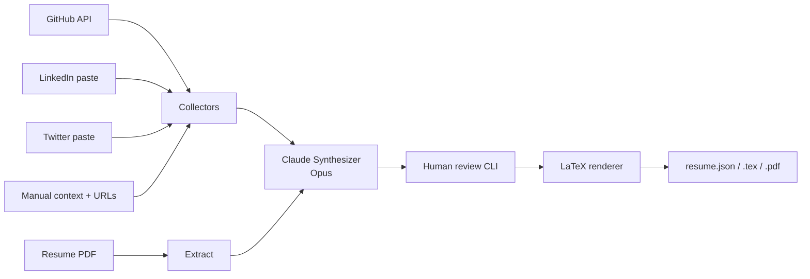

# Resume Agent

Multi-agent resume updater built with **LangGraph** and **Claude**. Pulls fresh data from GitHub, pasted LinkedIn/Twitter text, manual notes, and URLs — merges with your existing PDF — lets you review section-by-section — then renders a polished **LaTeX + PDF**.

```
PDF + GitHub + LinkedIn + URLs → [Collectors] → Claude Synthesizer → Review → LaTeX/PDF
```

---

## Docs

| Guide | What it covers |
|-------|---------------|
| [Getting Started](docs/getting-started.md) | Install, configure, first run |
| [CLI Reference](docs/cli-reference.md) | Every command and flag |
| [Inputs Guide](docs/inputs-guide.md) | What to put in each input file |
| [Edit Shell](docs/edit-shell.md) | Post-render interactive shell reference |
| [Config Reference](docs/config-reference.md) | Every `config.yaml` field |

---

## Quick Start

```bash
# 1. Clone and set up
git clone https://github.com/your-username/resume-agent
cd resume-agent
python3 -m venv .venv && source .venv/bin/activate
pip install -r requirements.txt

# 2. Secrets
cp .env.example .env
# → Edit .env, set ANTHROPIC_API_KEY (required)
#   Optionally set GITHUB_TOKEN for higher rate limits

# 3. Configure
# → Edit config.yaml — fill in your name, email, github_username, links
# → Put your current resume at inputs/resume.pdf
# → Fill inputs/manual_context.md, inputs/linkedin_profile.txt, etc.
#   (run `python -m src.main init-inputs` to create blank templates)

# 4. Run
python -m src.main update
```

See [Getting Started](docs/getting-started.md) for the full walkthrough.

---

## Architecture



| Agent | Role |
|-------|------|
| GitHub collector | Repos, languages, README excerpts via GitHub API |
| LinkedIn loader | Reads pasted profile text |
| Twitter loader | Reads pasted bio / pinned tweets |
| Manual context | Hackathon wins, recent projects, free-form notes; auto-fetches embedded URLs |
| URL fetcher | Fetches Devpost, blogs, project pages |
| Synthesizer | Claude Opus merges everything into structured resume JSON |
| Section reviser | Claude Sonnet applies feedback to individual sections |

---

## Key Features

- **Full pipeline in one command** — `update` collects, synthesizes, reviews, and renders
- **Interactive review** — approve/reject/refine each section with natural-language feedback before saving
- **Edit shell** — post-render REPL: compile PDF on demand, Claude edits, instant section reordering
- **Inline links** — `[text](url)` in any field becomes a clickable `\href` in the PDF
- **Section reordering** — `move education above experience` in the shell, or via Claude
- **Manual JSON edits** — edit `outputs/resume.json` in any editor, run `save` + `pdf` in the shell

---

## Requirements

- Python 3.11+
- `ANTHROPIC_API_KEY` (required — [get one here](https://console.anthropic.com/))
- `GITHUB_TOKEN` (optional — raises API rate limits; needed only for `github_username` collection or private repos)
- **PDF compiler**: [Tectonic](https://tectonic-typesetting.github.io/) (recommended) or TeX Live (`pdflatex`)

---

## Outputs

All outputs land in `outputs/`:

| File | Description |
|------|-------------|
| `resume.draft.json` | Raw synthesizer output before review |
| `resume.json` | Final approved resume (source of truth) |
| `resume.tex` | Generated LaTeX source |
| `resume.pdf` | Compiled PDF |

---

## License

MIT
