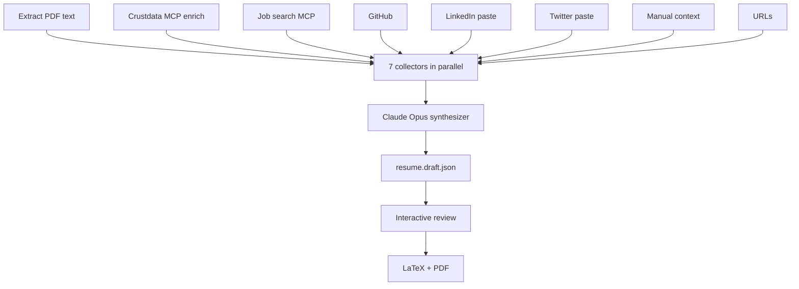

# Getting Started

This guide walks you from zero to a compiled, reviewed PDF resume.

---

## Prerequisites

| Requirement | Notes |
|-------------|-------|
| Python 3.11+ | `python3 --version` to check |
| Anthropic API key | [console.anthropic.com](https://console.anthropic.com/) — Claude Opus + Sonnet are used |
| PDF compiler | [Tectonic](https://tectonic-typesetting.github.io/) (recommended) or TeX Live (`pdflatex`) |
| GitHub PAT | Optional — only needed for `github_username` collection or private repos |
| Crustdata API key | Optional — for structured LinkedIn enrich and job targeting via MCP |

### Install Tectonic (macOS)

```bash
brew install tectonic
```

Or download a single binary from [tectonic-typesetting.github.io](https://tectonic-typesetting.github.io/).

---

## Step 1 — Clone and Install

```bash
git clone https://github.com/your-username/resume-agent
cd resume-agent

python3 -m venv .venv
source .venv/bin/activate      # Windows: .venv\Scripts\activate

pip install -r requirements.txt
```

---

## Step 2 — Set Up Secrets

```bash
cp .env.example .env
```

Open `.env` and fill in:

```env
ANTHROPIC_API_KEY=sk-ant-...        # required

# Optional — only needed if you set github_username in config.yaml
GITHUB_TOKEN=ghp_...

# Optional — Crustdata MCP (person enrich + job targeting)
CRUSTDATA_API_KEY=...
```

> `.env` is gitignored. Never commit it.

---

## Step 3 — Configure `config.yaml`

Open `config.yaml` and fill in the `profile` block. This is **always** used for your contact information in the resume header, regardless of what the synthesizer finds.

```yaml
profile:
  name: "Jane Doe"
  email: "jane@example.com"
  phone: "+1 555 000 0000"       # optional
  location: "San Francisco, CA"  # optional
  linkedin: "https://linkedin.com/in/janedoe"
  github: "https://github.com/janedoe"   # full URL or just username
  twitter: "https://x.com/janedoe"       # optional
  website: "https://janedoe.dev"          # optional
```

Then set your GitHub username if you want the GitHub collector to scan all your public repos:

```yaml
sources:
  github_username: "janedoe"       # leave empty to skip repo scanning
  github_max_repos: 30
  github_include_readmes: 5        # fetch READMEs for top N repos

  # Optional — structured LinkedIn via Crustdata MCP (~1 credit/run)
  crustdata_enabled: true
  crustdata_fields:
    - basic_profile
    - experience
    - education
    - skills
    - social_handles
```

Optionally enable **job-targeted tailoring** — the agent searches real job postings and aligns resume keywords to them (never fabricates experience):

```yaml
target:
  enabled: true
  titles: ["Backend Engineer", "Software Engineer"]
  location_country: "India"   # optional filter
  max_jobs: 15
```

Crustdata transport defaults to MCP. See [Config Reference](config-reference.md) for every field.

---

## Step 4 — Add Input Files

### Create blank templates

```bash
python -m src.main init-inputs
```

This creates empty starter files under `inputs/` without overwriting anything that already exists.

### What to put where

| File | What it contains |
|------|-----------------|
| `inputs/resume.pdf` | Your **current** resume (required — used as baseline) |
| `inputs/manual_context.md` | Hackathon wins, recent projects, notes; paste GitHub/Devpost links (auto-fetched) |
| `inputs/linkedin_profile.txt` | Copy-pasted text from your LinkedIn profile page |
| `inputs/twitter_profile.txt` | Your Twitter/X bio, pinned tweets |
| `inputs/urls.txt` | Extra URLs to fetch — one per line |

See [Inputs Guide](inputs-guide.md) for details and examples for each file.

> Example versions of all input files are in `inputs/examples/` — copy and adapt them.

---

## Step 5 — Run the Pipeline

```bash
python -m src.main update
```

What happens:



1. **Extract** — text is pulled from your PDF
2. **Collect** — seven collectors run in parallel (Crustdata person enrich, job search, GitHub, LinkedIn, Twitter, manual context, URLs). Job search is skipped unless `target.enabled: true`.
3. **Synthesize** — Claude Opus merges everything into a structured resume JSON (`outputs/resume.draft.json`)
4. **Review** — you see each section diff and choose: accept / reject / give feedback
5. **Render** — approved resume is written to `outputs/resume.json`, `resume.tex`, `resume.pdf`

Typical runtime: **2–5 minutes** depending on number of URLs and repos.

---

## Step 6 — Interactive Review

During review you'll see a diff for each section (summary, experience, projects, skills, education, achievements):

```
─── experience ──────────────────────────────────────────────
- Old: Senior Engineer at Acme Corp (2021–2023), 3 bullets
+ New: Senior Engineer at Acme Corp (2021–2023), 4 bullets (new: "Led migration to...")

[y] Accept  [n] Keep current  [f] Give feedback
```

| Key | Action |
|-----|--------|
| `y` + Enter | Accept the proposed change |
| `n` + Enter | Keep your existing version |
| `f` + Enter | Type natural-language feedback; Claude revises and shows you the diff again |

You can press `f` multiple times on the same section until you're happy.

---

## Step 7 — View and Edit the PDF

After `update` finishes, open the PDF:

```bash
python -m src.main compile --open
```

Or drop into the edit shell to iterate further:

```bash
python -m src.main shell
```

Inside the shell you can compile, open, and ask Claude to revise sections without re-running the full pipeline. See [Edit Shell](edit-shell.md) for the full reference.

---

## Typical Workflow

```
First time:
  init-inputs → fill files → update → review → shell → pdf → open

Subsequent updates:
  update → review → shell (if needed)

Quick tweak after reviewing PDF:
  shell → edit experience → pdf → open

Manual JSON edit:
  [edit outputs/resume.json in your editor] → shell → save → pdf
```

---

## Troubleshooting

### `ANTHROPIC_API_KEY is not set`
You either haven't created `.env`, or it's not in the project root. Run `cp .env.example .env` and fill it in.

### PDF not compiling
Check that `tectonic` or `pdflatex` is installed and on your `PATH`:
```bash
tectonic --version
# or
pdflatex --version
```
If neither is installed, you'll still get `.tex` and `.json` — you can compile later with `python -m src.main compile`.

### GitHub collector skipped
`github_username` is empty in `config.yaml`. Set it to your GitHub username to enable repo scanning. Without it, only URLs you paste manually are fetched.

### Crustdata collector skipped or errored
- Set `CRUSTDATA_API_KEY` in `.env` and `crustdata_enabled: true` in config
- Set `profile.linkedin` to your LinkedIn URL (or `sources.crustdata_profile_url`)
- Some field sections (e.g. `honors`, `certifications`) may be plan-gated — remove them from `crustdata_fields` if you get a 403
- Set `crustdata.transport: rest` to use the direct REST API instead of MCP

### Job targeting returned no results
- Set `target.enabled: true` and at least one entry in `target.titles`
- Broaden filters (remove `location_country` or try a more common title)
- Check credit balance on your Crustdata account (~1 credit per job returned)

### PDF text extraction returned little/no text
Your PDF might be image-based (scanned). The synthesizer will still run but with less baseline context. This is fine — your input files (manual context, LinkedIn, etc.) provide the signal.

### Synthesizer returned no resume
Usually means the Claude API call failed. Check:
- `ANTHROPIC_API_KEY` is valid and has credits
- Your internet connection
- Model names in `config.yaml` are current (defaults: `claude-opus-4-7`, `claude-sonnet-4-5`)
